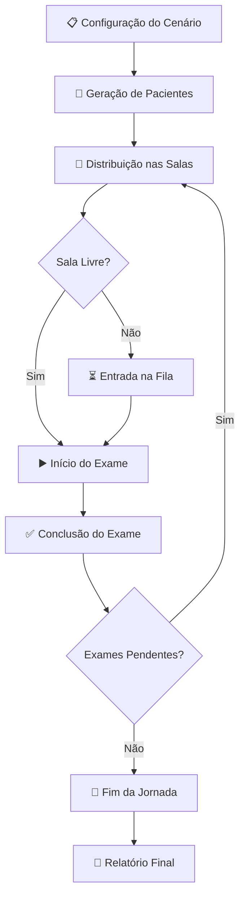

# 🔹 Blue System

Este projeto é um **simulador interativo de jornadas de pacientes em clínicas SESI**, desenvolvido com **Streamlit**.  
Ele permite **visualizar, analisar e otimizar o fluxo de exames**, oferecendo perspectivas tanto para **gestores** quanto para **funcionários/pacientes**.

---

## ✨ Funcionalidades

### 🎛️ Dashboard de Simulação (Gestor)
- Configuração de cenários de simulação:
  - Número de pacientes
  - Intervalo médio de chegada
  - Número máximo de exames por paciente
  - Duração total da simulação
- Acompanhamento **minuto a minuto** do status das salas:
  - Salas **livres** ✅
  - Salas **ocupadas** 🟧 (com tempo restante e fila de espera)
- **Logs de eventos** em tempo real (chegadas, inícios e finais de exames, entradas em fila)
- Relatório final com:
  - Tempo total de jornada por paciente
  - Horário de chegada e saída
  - Exames concluídos

### 👤 Visão do Cliente
- Acompanhamento da **jornada individual** de cada funcionário/paciente
- Lista de **exames concluídos** ✅ e **pendentes** 📋
- Indicação do **exame atual ou próximo exame**
- **Estimativa de fila e tempo de espera** ⏳
- Cálculo do **horário previsto** para o próximo atendimento 🕒
- Celebração quando a jornada é finalizada 🎉

---

## 🛠️ Tecnologias Utilizadas

- **Python 3**
- **Streamlit** → interface interativa
- **Pandas** → manipulação de dados
- **Random/Copy** → geração de cenários e cópias de estados da clínica
- **Datetime** → estimativas de horários
- **Session State** → memória persistente entre páginas do app

---

## 📂 Estrutura do Projeto

```text
Blue_System/
├── app.py                      # Dashboard de Simulação (gestor)
├── pages/
│   └── 2_visao_do_cliente.py   # Jornada individual do funcionário/paciente
└── README.md
````

---

## 🚀 Como Executar

1. Clone o repositório:

   ```bash
   git clone https://github.com/Gloterianota349/Blue_System.git
   cd Blue_System
   ```

2. Crie um ambiente virtual e instale as dependências:

   ```bash
   pip install streamlit pandas
   ```

3. Inicie o servidor Streamlit:

   ```bash
   streamlit run app.py
   ```

4. No navegador, acesse:

   👉 [http://localhost:8501](http://localhost:8501)

---

## 📊 Fluxo de Simulação



---

## 🎯 Casos de Uso

* **Gestores SESI**: analisar gargalos e tempo médio de atendimento.
* **Pacientes/Funcionários**: visualizar a jornada individual e prever tempo de espera.
* **Estudos Acadêmicos**: simulação de filas e dinâmica de fluxo em ambientes clínicos.


---

👨‍💻 Desenvolvido por [Guilherme Andrade](https://github.com/Gloterianota349)
